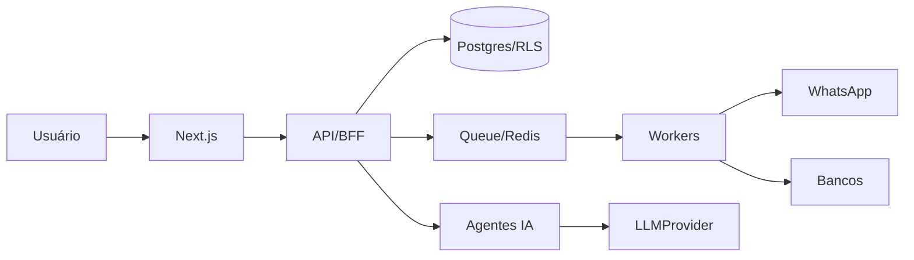

# CORBAN ENTERPRISE — MEMÓRIA MASTER DO PROJETO (v1.1)
## Documento-base para continuidade entre IAs e sessões

**Versão:** 1.1  
**Data:** 11/09/2026  
**Status:** Arquitetura / definição inicial  
**Regra:** Este documento é a fonte de verdade conceitual do projeto. Não misturar com outros projetos.  
**Hash de integridade:** _(preencher com SHA256 do arquivo após commit)_  
**Última alteração:** 11/09/2026 — revisão v1.1 (correções, lacunas, convenções)

---

# 0. GLOSSÁRIO

| Termo | Definição |
|---|---|
| **Corban** | Correspondente Bancário. Empresa que intermedia produtos bancários. |
| **Tenant / Organization** | Organização cliente do SaaS. Unidade de isolamento de dados. |
| **Matriz / Filial** | Subdivisão organizacional dentro de um tenant. |
| **Convênio** | Acordo entre banco e corban que habilita determinados produtos. |
| **Produto** | Produto bancário (ex.: consignado, FGTS, CLT, etc.). |
| **Modalidade** | Variação do produto (ex.: novo, refinanciamento, portabilidade). |
| **Tabela** | Conjunto versionado de regras (taxa, coeficiente, comissão). |
| **Esteira** | Pipeline de etapas pelas quais uma proposta passa. |
| **SLA** | Prazo máximo esperado em uma etapa. |
| **Lead** | Contato ainda não qualificado como cliente. |
| **Proposta** | Intenção formal de contratação enviada ao banco. |
| **Contrato** | Proposta aprovada e formalizada. |
| **Comissão** | Valor devido ao corban pela produção. |
| **Repasse** | Divisão da comissão entre empresa, corretor e vendedor. |
| **Conciliação** | Comparação entre comissão esperada e recebida. |
| **Agente de IA** | Componente automatizado com permissões próprias e supervisão humana. |

---

# 1. VISÃO DO PRODUTO

O projeto é um SaaS Enterprise para Correspondentes Bancários (Corban).

A visão não é criar apenas um CRM. O objetivo é criar um **Sistema Operacional para Corbans**, capaz de controlar vendas, rede comercial, operação, esteira de propostas/contratos, documentos, comissões, conciliação, gestão, automações e IA.

O sistema deverá ser multi-tenant, seguro, escalável, profissional e preparado para empresas pequenas e grandes operações de Corban.

---

# 2. PRINCÍPIO FUNDAMENTAL

O sistema deve ser construído para crescer sem necessidade de reconstrução da arquitetura.

Prioridades:

1. Segurança
2. Isolamento entre tenants
3. Rastreabilidade
4. Integridade financeira
5. Escalabilidade
6. Configurabilidade
7. Automação
8. Experiência do usuário
9. IA com supervisão humana
10. Independência de fornecedor de IA

---

# 3. NÃO-OBJETIVOS (ANTI-REQUISITOS)

Para evitar scope creep, ficam **fora do escopo** deste produto:

- Não seremos um ERP contábil completo.
- Não faremos folha de pagamento.
- Não substituiremos os sistemas internos dos bancos.
- Não seremos um CRM genérico de vendas (o foco é operação Corban).
- Não faremos emissão de nota fiscal própria (integração, sim; emissão nativa, não).
- Não seremos um serviço de assinatura digital (integração com provedores, sim).
- Não seremos um provedor de WhatsApp (integração, sim).

---

# 4. STACK INICIAL DEFINIDA

- Next.js
- App Router
- TypeScript
- Tailwind CSS
- Supabase
- PostgreSQL
- Row Level Security (RLS)
- Lucide React

**Decisões de infraestrutura fechadas (v1.1):**

| Área | Escolha | Observação |
|---|---|---|
| ORM / Migrations | **Drizzle ORM** | Melhor integração com SQL puro e RLS |
| Filas / Workers | **BullMQ + Redis** | Alternativa inicial aceitável: `pg-boss` (Postgres puro) |
| Validação | **Zod** | Compartilhada entre frontend e backend |
| Testes Unit/Integration | **Vitest** | + Testcontainers para Postgres real |
| Testes E2E | **Playwright** | |
| Logs estruturados | **pino** | |
| Feature flags | **tabela própria** (`feature_flags`) | Avaliar Unleash depois |

A estratégia de desenvolvimento deve priorizar ferramentas gratuitas, open source, free tiers e IA local/gratuita sempre que possível.

Nenhuma IA específica deve ser requisito do funcionamento do projeto.

---

# 5. MULTI-TENANT

O sistema será multi-tenant.

Estrutura conceitual:

```
Platform
└── Organization
    ├── Filiais
    ├── Equipes
    ├── Usuários
    ├── Corretores
    ├── Clientes
    ├── Leads
    ├── Propostas
    ├── Contratos
    ├── Comissões
    └── Dados operacionais
```

Regras:

- Nenhum tenant pode acessar dados de outro tenant.
- Toda entidade de negócio deve possuir contexto de organização.
- O isolamento deve existir no backend e no PostgreSQL/RLS.
- Não confiar apenas no frontend.
- Preparar suporte futuro a matriz/filiais e grupos empresariais.

---

# 6. USUÁRIOS, EQUIPES E PERMISSÕES

Não limitar o sistema a poucos cargos fixos.

Modelo:

```
User
Organization
Membership
Role
Permission
RolePermission
Team
TeamMember
```

Perfis iniciais possíveis:

- Administrador
- Diretor
- Gerente
- Supervisor
- Vendedor
- Digitador
- Mesa Operacional
- Financeiro
- Auditor
- Corretor
- Parceiro

Permissões devem ser granulares.

Exemplos:

```
clientes.visualizar
clientes.criar
clientes.editar
clientes.excluir

propostas.visualizar
propostas.criar
propostas.editar
propostas.aprovar

comissoes.visualizar
comissoes.calcular
comissoes.aprovar
comissoes.pagar

relatorios.visualizar
relatorios.exportar
usuarios.gerenciar
```

A função/cargo não deve ser a única camada de autorização.

---

# 7. REDE COMERCIAL

O sistema deve possuir um módulo próprio de Rede Comercial.

Tipos:

- Funcionários internos
- Vendedores
- Corretores
- Parceiros
- Agentes
- Afiliados

O corretor é uma entidade comercial própria, e não apenas um usuário.

Corretor:

- Dados cadastrais
- Usuário de acesso
- Gerente responsável
- Equipe
- Produtos habilitados
- Regras de comissão
- Metas
- Produção
- Propostas
- Contratos
- Comissões
- Histórico

Criar futuramente Portal do Corretor.

O corretor deve enxergar apenas o que tiver permissão para acessar.

---

# 8. TIME INTERNO DE VENDAS

Cada organização poderá possuir equipes comerciais.

Estrutura possível:

```
Organização
└── Gerente
    ├── Supervisor
    │   ├── Vendedores
    │   └── Corretores
    └── Vendedores
```

Deve suportar:

- metas
- ranking
- produtividade
- conversão
- distribuição de leads
- carteira
- comissão
- campanhas
- desempenho

---

# 9. LEADS

Lead é diferente de Cliente.

Fluxo:

```
Lead
→ Qualificação
→ Cliente
→ Simulação
→ Proposta
→ Contrato
```

Lead deve possuir:

- organization_id
- proprietário/responsável
- equipe
- origem
- campanha
- status
- score
- histórico
- timestamps

Distribuição automática de leads:

- Round Robin
- Por desempenho
- Por produto
- Por região
- Por equipe
- Por disponibilidade
- Regras personalizadas

Toda transferência de lead deve gerar histórico.

---

# 10. CRM

Módulo CRM:

- Leads
- Clientes
- Contatos
- Histórico
- Tarefas
- Carteiras
- Atendimento
- Timeline

Um cliente pode possuir múltiplas propostas e contratos.

**Regra de unicidade de CPF:**

- CPF é único **dentro de uma organização** (não globalmente).
- Não haverá unicidade global de CPF entre tenants (LGPD + realidade de mercado).
- Índice único deve ser **parcial**, ignorando registros soft-deleted:

```sql
CREATE UNIQUE INDEX clients_org_cpf_active_uniq
  ON clients (organization_id, cpf)
  WHERE deleted_at IS NULL;
```

---

# 11. PRODUTOS E OPERAÇÃO BANCÁRIA

Não modelar apenas Banco → Produto.

Estrutura recomendada:

```
Banco
→ Convênio
→ Produto
→ Modalidade
→ Tabela
→ Regras
```

Exemplos de produtos podem incluir diferentes modalidades de crédito, conforme integrações e configuração de cada organização.

O sistema deve ser configurável para diferentes bancos, convênios e produtos.

---

# 12. TABELAS DE PRODUTOS (VERSIONAMENTO)

Tabelas precisam de versionamento. Não sobrescrever tabela antiga.

**Modelagem corrigida (v1.1):** separar identidade lógica da versão.

```
ProductTable              -- identidade lógica
- id
- organization_id
- bank_id
- agreement_id            -- convênio
- product_id
- modality_id
- code                    -- ex.: "CONSIG-INSS-NOVO"
- status                  -- active | archived

ProductTableVersion       -- versão imutável
- id
- product_table_id        -- FK para ProductTable
- version                 -- 1, 2, 3...
- effective_from
- effective_until         -- nullable
- rate
- coefficient
- commission_rule_id
- created_by
- created_at
- notes
```

Regras:

- Uma `ProductTableVersion` **nunca é alterada** após publicada.
- Para mudar uma regra, cria-se nova versão com `effective_from` posterior.
- Uma proposta deve armazenar `product_table_version_id` (não apenas a tabela lógica).


# 13. SIMULADOR

Criar um Simulation Engine separado do CRM.

Entrada possível:

- cliente
- convênio
- margem
- idade
- produto
- prazo
- banco
- tabela

Saída:

- valor disponível
- parcela
- prazo
- taxa
- coeficiente
- banco
- produto
- comissão estimada

Futuro:

Comparação automática entre instituições/produtos elegíveis.

---

# 14. ESTEIRA

A esteira deve ser configurável, não hard-coded.

Modelo:

```
Pipeline
└── Stages
```

Cada etapa pode possuir:

- responsável
- equipe
- SLA
- prazo
- documentos obrigatórios
- automações
- notificações
- permissões
- regras

Exemplo:

```
Lead
→ Simulação
→ Documentação
→ Digitação
→ Análise
→ Pendência
→ Aprovado
→ Contrato
→ Pagamento
→ Comissão
→ Concluído
```

Cada organização poderá adaptar sua própria esteira.

**Concorrência:** movimentações de etapa devem usar **lock otimista** (`version` na proposta) para evitar que duas pessoas movam a mesma proposta simultaneamente.

---

# 15. TIMELINE

Criar Timeline universal para cliente/proposta/contrato.

Registrar:

- criação
- contato
- simulação
- documento enviado
- proposta criada
- envio ao banco
- mudança de status
- pendência
- aprovação
- contrato
- pagamento
- comissão

A Timeline deve ser auditável.

---

# 16. DOCUMENTOS

Documento deve ser entidade própria.

Modelo conceitual:

```
Document
- client_id
- proposal_id
- contract_id
- type
- storage_path
- version
- uploaded_by
- uploaded_at
- status
- hash
- metadata
```

Recursos:

- Storage privado
- Versionamento
- Controle de acesso
- Auditoria
- Validade
- Classificação
- Documentos obrigatórios por etapa

Futuro uso de IA:

- classificação
- extração
- identificação de documentos
- detecção de ausência
- identificação de inconsistências

---

# 17. CONTRATOS E ASSINATURA

Contrato é entidade própria, distinta de Proposta.

```
Contract
- id
- organization_id
- proposal_id
- client_id
- bank_id
- product_table_version_id
- template_id
- status             -- draft | sent | signed | cancelled | expired
- signed_at
- signed_by
- storage_path
- hash
- metadata
```

Recursos:

- Versionamento de template
- Geração de PDF
- Integração futura com assinatura eletrônica (Clicksign, D4Sign, DocuSign)
- Registro de evidências de assinatura
- Imutabilidade após assinatura

---

# 18. SLA

O sistema deve controlar SLA por etapa.

Exemplo:

```
Proposta recebida
→ prazo de 4 horas
```

Estados:

- normal
- atenção
- próximo do vencimento
- atrasado
- crítico

Dashboards devem mostrar gargalos e propostas fora do SLA.

---

# 19. AGENTE DE IA — CONTROLADOR DA ESTEIRA

Este é um componente estratégico do projeto.

Nome conceitual:

**Corban AI — Agente de Operações / AI Workflow Agent**

Função:

Monitorar continuamente a esteira e identificar:

- propostas paradas
- pendências
- documentos faltantes
- responsáveis
- próximos passos
- SLA
- gargalos
- necessidade de escalonamento

Fluxo:

```
Evento
→ Motor de Regras
→ IA
→ Decisão
→ Ação permitida
```

A IA não deve decidir tudo sozinha.

Regras determinísticas devem controlar bloqueios críticos.

---

# 20. ATUAÇÃO DO AGENTE DE IA

Níveis:

**Nível 1 — Assistente**
- informa situações
- recomenda ações

**Nível 2 — Operacional**
- cria tarefas
- envia notificações
- distribui tarefas
- solicita documentos
- atualiza ações permitidas

**Nível 3 — Supervisor**
- identifica gargalos
- alerta responsáveis
- recomenda redistribuição

**Nível 4 — Escalonamento**
- Digitador → Supervisor → Gerente → Gestor

O agente deve possuir permissões próprias e nunca possuir acesso irrestrito.

**Auditoria de IA (v1.1):** toda ação da IA deve registrar:

- prompt enviado
- contexto utilizado
- output do modelo
- decisão tomada
- ação executada
- reversibilidade
- quem supervisionou (se aplicável)

---

# 21. EXEMPLO DE CONTROLE DA ESTEIRA

Proposta entra.

IA/sistema verifica:

- documentação
- responsável
- etapa
- SLA
- pendências
- horário

Se estiver pronta para digitação:

Notificar digitador.

Se ficar parada:

- alerta
- lembrete
- escalonamento

Se o SLA vencer:

- supervisor
- gerente

Exemplo:

```
08:00 recebida
08:20 enviada para digitação
09:20 ainda não iniciada
09:50 próximo do SLA
10:20 SLA vencido
→ escalonamento
```

---

# 22. CENTRAL DA IA

Criar futuramente:

Central Operacional da IA

Indicadores:

- críticas
- próximas do SLA
- aguardando ação
- processadas
- gargalos

A IA deve apresentar:

- problema
- responsável
- motivo
- prazo
- impacto
- ação recomendada

---

# 23. FINANCEIRO E COMISSÕES

Comissão não deve ser apenas percentual.

Criar Rules Engine.

Regra pode considerar:

- banco
- produto
- convênio
- modalidade
- prazo
- valor
- percentual
- valor fixo
- bônus
- deduções
- impostos
- prioridade
- vigência

As regras devem ser versionadas.

---

# 24. COMISSÃO CALCULADA ≠ COMISSÃO PAGA

Máquina de estados explícita (v1.1):

```
Calculated → Validated → Approved → Released → Paid
     ↓            ↓           ↓          ↓        ↓
  Disputed    Disputed    Disputed   Reversed  Reversed
     ↓
  Adjusted → (reentra no fluxo como novo Calculated)
```

Também suportar:

- divergência
- contestação
- estorno
- ajuste
- histórico

Uma comissão antiga não pode mudar porque uma regra nova foi cadastrada.

**Comissões pagas são imutáveis.** Ajustes geram novo registro de ajuste, nunca sobrescrevem.

---

# 25. REPASSE PARA CORRETORES E VENDEDORES

Exemplo:

```
Banco paga comissão
→ Empresa
→ Corretor
→ Vendedor
→ Resultado líquido
```

O sistema deve permitir regras diferentes por:

- corretor
- vendedor
- produto
- banco
- campanha
- período

Exemplo:

```
Corretor A: 50%
Corretor B: 55%
Corretor C: 60%
```

Sempre com histórico e vigência.

---

# 26. CONCILIAÇÃO

Objetivo:

Comparar:

Comissão esperada vs Comissão recebida

Exemplo:

```
Esperado: R$ 82.450
Recebido: R$ 79.820
Divergência: R$ 2.630
```

Fluxo:

```
Produção
→ Comissão esperada
→ Comissão recebida
→ Conciliação
→ Divergência
→ Investigação
→ Aprovação
```

Ações financeiras críticas devem exigir verificação humana.

---

# 27. IMPORTAÇÃO

Suportar Excel/CSV de sistemas legados.

Fluxo:

```
Upload
→ Reconhecimento
→ Mapeamento
→ Validação
→ Prévia
→ Duplicidades
→ Importação
→ Log
```

Futuro:

IA pode ajudar a reconhecer colunas equivalentes.

Exemplo:

```
CPF
CPF CLIENTE
DOCUMENTO
NR CPF
→ provável campo CPF
```

---

# 28. WHATSAPP E INTEGRAÇÕES

Preparar arquitetura assíncrona.

```
Frontend
→ API
→ Banco
→ Queue
→ Worker
→ WhatsApp
```

Entrada:

```
WhatsApp
→ Webhook
→ API
→ Queue
→ Worker
→ Banco
→ Realtime
→ Frontend
```

Não acoplar o sistema a um único provedor.

Criar Integration Layer.

Futuras integrações:

- WhatsApp
- bancos
- APIs
- webhooks
- e-mail
- SMS
- storage
- contabilidade
- outros sistemas

---

# 29. API PÚBLICA E WEBHOOKS DE SAÍDA

Além de webhooks de entrada, o sistema deve poder **notificar sistemas externos**.

Requisitos:

- Versionamento de API (`/v1/`, `/v2/`)
- Autenticação por API Key e/ou OAuth
- Rate limiting por tenant
- Idempotency-Key em POST/PUT
- Retry com backoff exponencial
- Dead Letter Queue (DLQ) para falhas persistentes
- Logs de entrega e falha
- Assinatura HMAC dos payloads

---

# 30. EVENTOS

Criar arquitetura orientada a eventos.

Eventos conceituais:

- LeadCreated
- LeadTransferred
- ProposalCreated
- ProposalStatusChanged
- DocumentUploaded
- DocumentMissing
- ProposalApproved
- ContractPaid
- CommissionCalculated
- CommissionDivergenceDetected
- CommissionApproved

Eventos podem acionar:

- notificações
- IA
- auditoria
- automações
- dashboards
- integrações

**Convenção (v1.1):** eventos em `PascalCase`; tabelas em `snake_case` plural; colunas em `snake_case`; tipos TS em `PascalCase`.


# 31. FILAS E WORKERS

**Decisão fechada:** **BullMQ + Redis**.

Alternativa inicial aceitável caso Redis não esteja disponível: **pg-boss** (Postgres puro).

Usos:

- WhatsApp
- notificações
- importações
- conciliação
- documentos
- relatórios
- automações
- webhooks
- processamento de IA

Evitar tarefas pesadas dentro de requisições HTTP.

**Idempotência:** todo job deve aceitar `idempotency_key` para evitar processamento duplicado.

---

# 32. IDEMPOTÊNCIA E CONCORRÊNCIA

Requisitos transversais:

- Operações financeiras exigem `idempotency_key`.
- Webhooks de entrada exigem validação de assinatura + idempotência.
- Movimentação de proposta usa **lock otimista** (`version`).
- Cálculo de comissão roda em transação ACID.
- Distribuição de leads usa lock para evitar atribuição dupla.
- Importações geram hash do arquivo para evitar duplicidade.

---

# 33. NOTIFICAÇÕES

Canais:

- in-app
- e-mail
- WhatsApp
- push (futuro)

Modelo conceitual:

```
Notification
- user_id
- organization_id
- channel
- template_id
- payload
- status           -- pending | sent | failed | read
- sent_at
- read_at
- dedup_key
```

Recursos:

- Preferências por usuário
- Templates versionados
- Agrupamento (digest)
- Supressão fora de horário
- Deduplicação por `dedup_key`

---

# 34. AUDITORIA

Criar `audit_logs`.

Registrar:

- usuário
- organização
- ação
- entidade
- registro
- valor anterior
- valor novo
- data/hora
- IP
- user agent
- motivo quando aplicável

Eventos importantes:

- login
- criação
- alteração
- exclusão
- alteração financeira
- comissão
- permissões
- exportações
- importações
- status
- aprovação

Registros financeiros críticos devem ser rastreáveis e, quando necessário, imutáveis.

---

# 35. SOFT DELETE E IMUTABILIDADE

Regra geral:

| Entidade | Estratégia |
|---|---|
| Clientes, Leads | `deleted_at` (soft delete) |
| Propostas | `status = 'cancelled'` |
| Contratos | `status = 'cancelled'` (nunca delete) |
| Comissões pagas | **imutáveis** |
| `audit_logs` | **imutáveis** |
| `ProductTableVersion` | **imutáveis** |
| Documentos | soft delete + retenção LGPD |

---

# 36. LOCALIZAÇÃO E FORMATAÇÃO

- Timestamps armazenados em **UTC** no banco.
- Exibição padrão em **America/Sao_Paulo**.
- Formatação de moeda: `pt-BR` / `BRL`.
- CPF, CNPJ, telefone, CEP: máscaras `pt-BR`.
- Validação de CPF/CNPJ no backend (Zod + lib própria).

---

# 37. SEGURANÇA

Requisitos:

- RLS
- autorização no backend
- validação de entrada
- Zod
- rate limiting
- proteção contra XSS
- proteção contra SQL injection
- CORS
- security headers
- gerenciamento de sessão
- MFA/2FA futuramente
- logs
- auditoria
- storage privado
- segregação de funções

Nunca confiar no frontend para autorização.

---

# 38. LGPD

Preparar desde a arquitetura:

- controle de acesso
- minimização de dados
- rastreabilidade
- retenção
- exclusão lógica
- anonimização quando aplicável
- exportação controlada
- armazenamento privado
- proteção de dados
- registro de origem quando necessário

---

# 39. BACKUP E RECUPERAÇÃO (DR)

Metas iniciais:

- **RPO:** 1 hora
- **RTO:** 4 horas

Requisitos:

- Backup automático do Postgres (Supabase PITR quando disponível)
- Backup do Storage
- Retenção mínima: 30 dias
- Teste de restore trimestral
- Documentar procedimento de restore em `/docs/DR.md`

---

# 40. DASHBOARDS

**Dashboard CEO/Admin:**
- produção
- faturamento
- comissão
- resultado
- conversão
- produção por banco
- produto
- operador
- pendências
- SLA

**Dashboard Gerente:**
- equipe
- produção
- conversão
- ranking
- esteira
- pendências

**Dashboard Operador:**
- propostas
- pendências
- tarefas
- clientes
- SLA

---

# 41. KPIs

- Leads
- Leads qualificados
- Simulações
- Propostas
- Aprovações
- Contratos
- Valor produzido
- Ticket médio
- Conversão
- Tempo médio
- Cancelamentos
- Pendências
- Comissão prevista
- Comissão recebida
- Divergências
- Produtividade

---

# 42. METAS E GAMIFICAÇÃO

Metas:

- empresa
- filial
- equipe
- gerente
- supervisor
- vendedor
- corretor
- produto
- banco

Ranking:

- produção
- conversão
- contratos
- menor SLA
- ticket
- outros indicadores configuráveis

Campanhas:

- período
- produto
- meta
- bônus
- participantes
- regras

---

# 43. FEATURE FLAGS

Preparar ativação de funcionalidades por organização/plano.

Exemplo:

```
WhatsApp: ON
IA: OFF
Conciliação: ON
Multi-filial: ON
```

Implementação inicial: tabela própria (`feature_flags`).

---

# 44. BILLING DO SAAS

Preparar futuramente:

- Free
- Starter
- Professional
- Enterprise

Limites possíveis:

- usuários
- armazenamento
- propostas
- automações
- IA
- WhatsApp
- filiais
- relatórios

---

# 45. OBSERVABILIDADE

Preparar:

- logs estruturados (pino)
- erros
- métricas
- performance
- jobs
- filas
- webhooks
- integrações
- saúde dos serviços

Futuro painel:

```
API
Database
Storage
Queue
WhatsApp
Workers
```


# 46. IA NATIVA FUTURA

Agentes especializados:

- Agente de Esteira
- Agente Comercial
- Agente de Documentos
- Agente de Conciliação
- Agente de Atendimento
- Agente de Gestão
- Agente Analítico

Exemplos:

- "Quais propostas estão paradas há mais de 48 horas?"
- "Quais leads devo priorizar?"
- "Quais comissões estão divergentes?"
- "Por que a produção caiu?"
- "O que falta nesta proposta?"

---

# 47. ARQUITETURA CONCEITUAL

```
Frontend
→ Next.js (App Router)
→ Server Actions (operações internas)
→ API/BFF (integrações externas, webhooks)

API/BFF
→ Application Layer
→ Domain Services
   → CRM
   → Esteira
   → Simulação
   → Comissão
   → Documentos
   → Rede Comercial

Infraestrutura
→ PostgreSQL/Supabase
→ Storage
→ Redis
→ Queue (BullMQ)
→ Workers

Integrações
→ WhatsApp
→ Bancos
→ APIs
→ Webhooks

IA
→ Agentes
→ LLMProvider (abstração)
→ LLMs (Gemini, Ollama, outros)
```



---

# 48. DESENVOLVIMENTO COM IA GRATUITA

O projeto deve ser independente de uma IA específica.

Possíveis ferramentas de desenvolvimento:

- Gemini gratuito
- Ollama
- modelos locais
- outras IAs gratuitas ou com free tier

A documentação do projeto deve ser a fonte de verdade.

Se uma IA atingir limite, outra IA deve conseguir continuar.

Nenhuma IA deve assumir decisões não documentadas.

**Abstração obrigatória:** criar interface `LLMProvider` desde o início, mesmo que só exista um provider. Trocar de IA depois não pode exigir refactor grande.

---

# 49. ESTRATÉGIA DE TESTES

Pirâmide:

- **Unit (Vitest):** regras de negócio puras (comissão, simulação, SLA)
- **Integration (Vitest + Testcontainers):** Postgres real, RLS, migrations
- **E2E (Playwright):** fluxos críticos (lead → proposta → contrato → comissão)
- **Contract tests:** integrações externas (WhatsApp, bancos)

Regras:

- Toda função financeira deve ter testes de borda.
- Toda migration deve ter teste de rollback.
- RLS deve ter teste por tenant.

---

# 50. DOCUMENTAÇÃO DE CONTINUIDADE

Criar no projeto:

```
/docs
- ARCHITECTURE.md
- DATABASE.md
- SECURITY.md
- MULTI-TENANT.md
- RBAC.md
- API.md
- BUSINESS-RULES.md
- ROADMAP.md
- DR.md
- GLOSSARY.md
- adr/
  - 0001-uso-de-rls.md
  - 0002-drizzle-como-orm.md
  - ...

/.ai
- MASTER-CONTEXT.md
- CURRENT-TASK.md
- DECISIONS.md
- CHANGELOG.md
- RULES.md
```

---

# 51. REGRA DE CONTINUIDADE ENTRE SESSÕES

Quando houver limite de chat/sessão:

1. Este arquivo deve ser enviado para a nova IA.
2. Deve ser enviado também o arquivo de estado atual do desenvolvimento.
3. A nova IA deve ler os dois arquivos antes de alterar código.
4. Não deve reinventar arquitetura já decidida.
5. Deve registrar novas decisões.
6. Deve atualizar o CHANGELOG.
7. Deve atualizar CURRENT-TASK.
8. Deve informar claramente o que foi feito e o próximo passo.

---

# 52. ARQUIVO DE ESTADO DO SISTEMA

Além desta memória master, manter um segundo arquivo:

**`CORBAN-CURRENT-STATE.md`**

Esse arquivo deve conter:

- estágio atual
- funcionalidades implementadas
- banco/migrations existentes
- arquivos importantes
- erros conhecidos
- pendências
- testes
- última alteração
- próximo passo
- decisões recentes

A combinação dos dois arquivos permite retomar o projeto mesmo após mudança de IA ou sessão.

---

# 53. ROADMAP INICIAL (v1.1 reordenado)

```
FASE 0  — Arquitetura e documentação
FASE 1  — Fundação técnica (Next, Supabase, Drizzle, CI, testes)
FASE 2  — Multi-tenant + Auth + RBAC
FASE 3  — Cadastros base (Clientes, Produtos, Bancos, Convênios, Tabelas versionadas)
FASE 4  — Rede Comercial + CRM
FASE 5  — Simulador
FASE 6  — Esteira + SLA + Timeline
FASE 7  — Documentos
FASE 8  — Contratos + Assinatura (integração)
FASE 9  — Comissões + Conciliação
FASE 10 — Dashboards + Metas + BI
FASE 11 — Notificações + WhatsApp + Integrações
FASE 12 — Agente de IA Operacional
FASE 13 — IA avançada + automações
FASE 14 — API pública + Webhooks de saída
FASE 15 — Billing + Enterprise + escala
```

---

# 54. CONVENÇÕES DE CÓDIGO

| Item | Convenção |
|---|---|
| Tabelas | `snake_case` plural (`clients`, `proposals`) |
| Colunas | `snake_case` (`organization_id`) |
| Tipos TS | `PascalCase` (`Client`, `Proposal`) |
| Eventos | `PascalCase` (`LeadCreated`) |
| Arquivos TS | `kebab-case` (`client-service.ts`) |
| Componentes React | `PascalCase` (`ClientCard.tsx`) |
| Rotas | `kebab-case` (`/api/v1/leads`) |
| Migrations | `YYYYMMDDHHMMSS_descricao.sql` |

---

# 55. REGRA DE OURO DO PROJETO

Não criar funcionalidades isoladas sem considerar:

- multi-tenant
- segurança
- permissões
- auditoria
- escalabilidade
- eventos
- IA
- integração
- histórico
- versionamento

Toda nova funcionalidade deve responder:

1. Quem pode acessar?
2. Qual tenant possui os dados?
3. Qual regra de negócio?
4. Qual evento é gerado?
5. Precisa de auditoria?
6. Precisa de SLA?
7. Pode ser automatizada?
8. A IA poderá atuar futuramente?
9. Como será testada?
10. Como será retomada por outra IA?
11. Qual o custo operacional (storage, IA, filas)?
12. Como se comporta com 10.000 tenants e 1M de propostas?

---

# 56. STATUS DESTE DOCUMENTO

Este documento define a visão e os requisitos arquiteturais iniciais.

Ainda **NÃO** significa que todas as funcionalidades foram implementadas.

O arquivo `CORBAN-CURRENT-STATE.md` deve ser usado para saber o que realmente já existe no código.

**IMPORTANTE:**
Não confundir "planejado" com "implementado".

